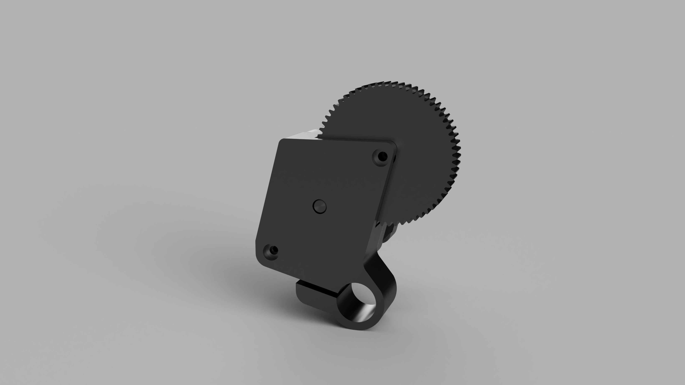

# Part List

**Note:** One might be able to purchase the required screws from the local hardware store for less since they can be purchased without an entire set of screws. These screws are standard screws so it also might be helpful to have them for other projects including other parts of the AquaMOCO system.


| Part              | Link | Quantity | Price Per Part | Total |
|:------------------|:-----|---------:|---------------:|------:|
| 1 kg PLA 1.75 mm filament | [Amazon](https://smile.amazon.com/HATCHBOX-3D-Filament-Dimensional-Accuracy/dp/B00J0ECR5I) | 0.035 | $24.99 | $0.88 |
| Nema 17 Stepper Motor 24 | [Amazon](https://smile.amazon.com/gp/product/B07TGJSNJB/) | 1 | $9.99 | $9.99 |
| M3 6mm Pan Head Screw | [Amazon](https://smile.amazon.com/Yootop-Stainless-Phillips-Machine-Fastener/dp/B07HD1DMBP/) | 4 | - | $8.99 |
| M5 8mm Hex Socket Head Cap Machine Screw | [Amazon](https://smile.amazon.com/gp/product/B07F75DMHF/) | 1 | $28.89 | $28.89 |
| M3 8mm Hex Socket Head Cap Machine Screw | - | 1 | - | - |
| M3 12mm Hex Socket Head Cap Machine Screw| - | 1 | - | - |
| **Total** | | | | **$48.85** |




# Print Settings


| All Parts | |
|-----------|-|
| Infill: | 30% |
| Supports: | None |
| Rafts: | None |
| Filament material: | PLA |


# Assembly Instructions

1. Attach the stepper motor to the base with four M3 6mm screws. Make sure the stepper motor wire connector is facing towards the base's camera rail slot.
2. Place the large gear on the base's shaft.
3. Push the small gear on the stepper motor shaft and align with the larger gear. This might require a hammer.
4. Place the lid on top of the entire assembly.
5. Use the M3 12mm screw to attach the base shaft to the lid. Use a reasonable amount of force while screwing. The screw will self tap into the plastic.
6. Use the M3 8mm screw to attach the base to the lid near the hole for the camera rail.
7. If one has a M5, tap use it to tap the hole at the bottom of the assembly.
8. Screw in the M5 8mm screw into the whole at the bottom of the assembly.

