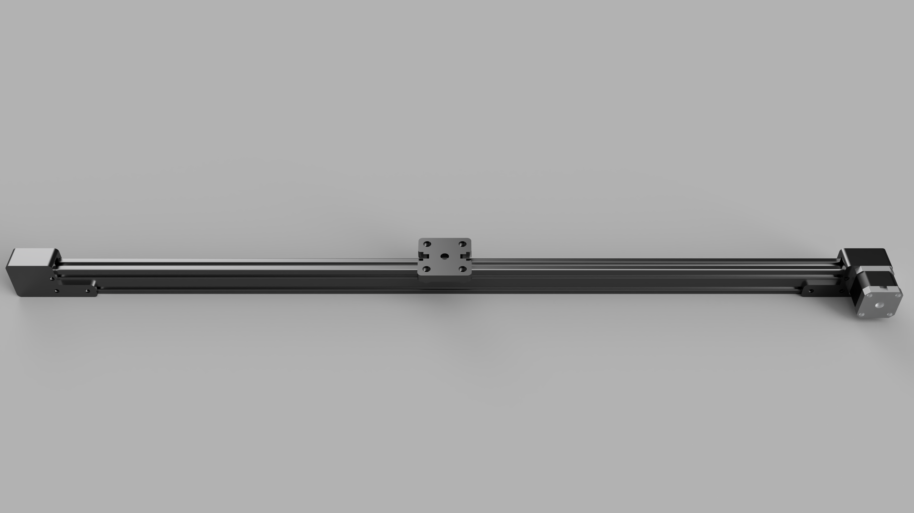

# Part List

**Note:** One might be able to purchase the required screws from the local hardware store for less since they can be purchased without an entire set of screws. These screws are standard screws so it also might be helpful to have them for other projects including other parts of the AquaMOCO system.


| Part              | Link | Quantity | Price Per Part | Total |
|:------------------|:-----|---------:|---------------:|------:|
| 1 kg PLA 1.75 mm filament | [Amazon](https://smile.amazon.com/HATCHBOX-3D-Filament-Dimensional-Accuracy/dp/B00J0ECR5I) | 0.09 | $24.99 | $2.25 |
| 4" Zip Ties | [Amazon](https://smile.amazon.com/Cable-Nylon-Locking-Pieces-Black/dp/B07VRSQ6YL/) | 2 | - | $3.99 |
| 2040 T-Slot |[Amazon](https://smile.amazon.com/gp/product/B07PNXNZZV/)| 1 | $30.99 | $30.99 |
| 2020 Pulley Wheels | [Amazon](https://smile.amazon.com/ExcelFu-Plastic-Pulley-Bearing-Printer/dp/B07GF9VGHD) | 4 | - | $11.99 | 
| 5 Meters GT2 Timing Belt Width 6mm | [Amazon](https://smile.amazon.com/gp/product/B071K8HYB4/)| 1 | $7.99 | $7.99 |
| 8mm ID 16mm OD 5mm Bore Ball Bearings | [Amazon](https://smile.amazon.com/gp/product/B082PQ3SC4/)| 1 | $12.49 | $12.49 |
| Nema 17 Stepper Motor 40 | [Amazon](https://smile.amazon.com/FYSETC-Printer-Stepper-Extruder-Creality/dp/B07GDD2X4B/) | 1 | $17.99 | $17.99 |
| M3 T Slot Nut | [Amazon](https://smile.amazon.com/gp/product/B07PLKVW69/) | 12 | - | $11.99 |
| M3 8mm Hex Socket Head Cap Machine Screws | [Amazon](https://smile.amazon.com/gp/product/B07F75DMHF/) | 12 | - | $28.89 |
| M3 20mm Hex Socket Head Cap Machine Screws | - | 1 | - | - |
| M3 6mm Pan Head Screw | [Amazon](https://smile.amazon.com/Yootop-Stainless-Phillips-Machine-Fastener/dp/B07HD1DMBP/) | 4 | - | $8.99 |
| M5 30mm Hex Socket Head Cap Machine Screws | [Amazon](https://smile.amazon.com/DYWISHKEY-Pieces-Stainless-Steel-Socket/dp/B07X3RX915/) | 4 | - | $9.99 |
| M5 Nylon Nut | [Amazon](https://smile.amazon.com/gp/product/B071GF2Z67/) | 4 | -  | $13.62 |
| **Total** | | | | **$161.17** |




# Print Settings


| All Parts | |
|-----------|-|
| Infill: | 30% |
| Supports: | For both pulleys |
| Rafts: | None |
| Filament material: | PLA |


# Assembly Instructions

## Stepper Motor

1. Take three of the M3 t slot nuts and place two on the lower rail of the 2040 bar on the right side. Place one on the upper rail also on the right side.
2. Place the stepper base part flush against the 2040 bar and align the t slot nuts with the holes on the base part.
3. Use three M3 8mm screws to attach the stepper base to the 2040 bar.
4. Place the stepper motor against the base so that the shaft is contained by the base part.
5. Use four M3 6mm pan head screws to attach the stepper motor to the base.
6. Put the stepper motor spacer down around the shaft of the stepper motor.
7. Place the stepper motor pulley on the stepper shaft such that the attached spacer is pointed away from the previously placed spacer.
8. Take three M3 t slot nuts and place them like step one on the other side of the 2040 bar. Mirroring the previous pattern.
9. Place the stepper motor lid on top of the assembly and align the t slot nuts with the holes.
10. Use three M3 8mm screw to attach the lid.

## Carriage

1. Take the carriage part and four M5 30mm bolts and place the four bolts through the top of the carriage.
2. Take four 2020 Pulley wheels and place them on the bottom of the carriage attached to the newly placed bolts.
3. Take four M5 nylon nuts and attach to the end of the bolts and tighten until snug. Be sure not to over tighten.
4. Place the entire assembly so the carriage is on top of the 2040 bar and the wheels are in the upper groove of the 2040 bar.
5. Make sure the carriage can move along the 2040 bar freely.

## Spinner

1. Take three M3 t slot nuts and place two on the lower rail of the 2040 bar on the opposite side of the stepper motor assembly. Place one on the upper rail.
2. Place the spinner base flush against the 2040 bar and alight the t slot nuts with the holes on the base part.
3. Use three M3 8mm screws to attach the spinner base to the 2040 bar.
4. Take the spinner pulley and push the bearing into the center.
5. Take spinner spacer one and place it on top the bearing such that the spacer cannot move.
6. Place the pulley assembly around the shaft of the spinner base with the spacer facing down, resting on the base.
7. Place spinner spacer two around the shaft on top of the pulley assembly.
8. Take three M3 t slot nuts and place them like step one on the other side of the 2040 bar.
9. Place the spinner lid on top of the assembly and align the t lot nuts with the holes.
10. Use three M3 8mm screws to attach the lid.
11. Use the M3 20mm screw to attach the lid to the base by place the screw in that goes to the shaft of the base piece. Screw until flush with the lid.

## Belt

1. Take one side of the belt and loop it through the hole in the carriage so that the belt's teeth are facing towards the 2040 bar and the smooth part of the belt is exposed.
2. Pinch the loop created so that the teeth are interlocked and zip tie the loop in place.
3. Thread the belt through the stepper motor pulley, the center of the 2040 bar, and the spinner pulley.
4. Repeat step 1 with the hole at the other end of the carriage tightening the belt as much as reasonably possible. Step 5 will take care of tensioning the belt.
5. Loosen the screws keeping the spinner assembly attached to the 2040 bar. Pull the spinner assembly away from the 2040 bar until the belt is taut and tighten the screws.

